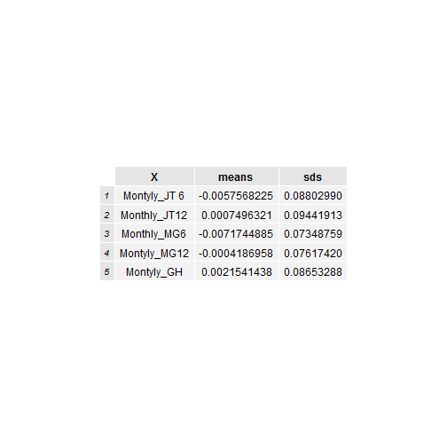
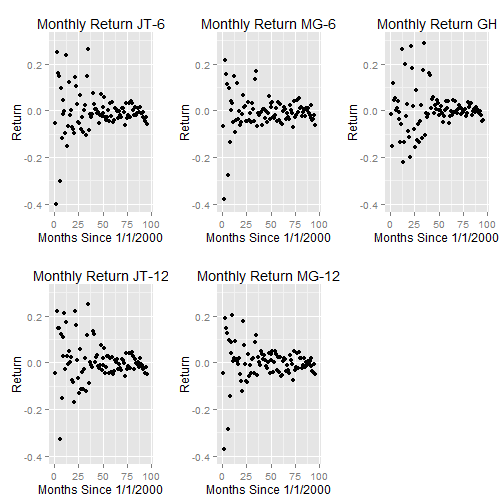

The Replication of "The 52-Week High and Momentum Investing"
========================================================
author: Ziqi Lu and Yolanda Zhao
date: 01/27/15

First Slide: What Did We do?
========================================================

- Compare 3 Momentum Strategies: JT, MG, GH
- Monthly Profitability (Original paper)
- Deviations and Time (Extension)

1st Step:Rank stocks by past performances
========================================================
- 1.Jegadeesh and Titman (1993)--stock returns
- 2.Moskowitz-Grinblatt (1999)--industry returns
- 3.52 Week High (2004)--stock prices
- Past 6 months or 12 months

2nd Step: Form Winner(Loser) portfolios
========================================================
- top 13%: Winner (buy)
- top 13%: Loser  (short)
- Hold each portfolio for 6 months

Results-Table
========================================================
- Differences in Profitability
- High Standarad Deviations

 

Results-Graph
========================================================
- Fluctuations and Risks
    1.How about 1998 Financial Crisis?
- Extention of Time

 
